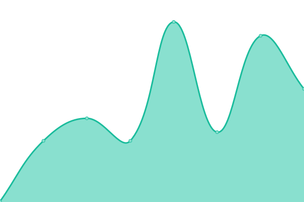

# [📈 Live Status](https://mapmaker-workshop-tools.github.io/upptime): <!--live status--> **🟧 Partial outage**

This repository contains the open-source uptime monitor and status page for [Mapmaker](https://mapmaker.nl), powered by [Upptime](https://github.com/upptime/upptime).

With [Upptime](https://upptime.js.org), you can get your own unlimited and free uptime monitor and status page, powered entirely by a GitHub repository. We use [Issues](https://github.com/mapmaker-workshop-tools/upptime/issues) as incident reports, [Actions](https://github.com/mapmaker-workshop-tools/upptime/actions) as uptime monitors, and [Pages](https://mapmaker-workshop-tools.github.io/upptime) for the status page.

<!--start: status pages-->
<!-- This summary is generated by Upptime (https://github.com/upptime/upptime) -->
<!-- Do not edit this manually, your changes will be overwritten -->
<!-- prettier-ignore -->
| URL | Status | History | Response Time | Uptime |
| --- | ------ | ------- | ------------- | ------ |
|  [Django - Production](https://mapmaker.nl) | 🟥 Down | [django-production.yml](https://github.com/mapmaker-workshop-tools/Status-Page/commits/HEAD/history/django-production.yml) | 

 0ms
     
 | 

<a href="https://status.mapmaker.nl/history/django-production">0.00%</a>
    

|  [Django - Triage](https://triage.mapmaker.nl) | 🟥 Down | [django-triage.yml](https://github.com/mapmaker-workshop-tools/Status-Page/commits/HEAD/history/django-triage.yml) | 

 0ms
     
 | 

<a href="https://status.mapmaker.nl/history/django-triage">0.00%</a>
    

|  [NGINX](https://mapmaker.nl/healthcheck) | 🟥 Down | [nginx.yml](https://github.com/mapmaker-workshop-tools/Status-Page/commits/HEAD/history/nginx.yml) | 

 0ms
     
 | 

<a href="https://status.mapmaker.nl/history/nginx">0.00%</a>
    

|  [Status page](https://status.mapmaker.nl) | 🟩 Up | [status-page.yml](https://github.com/mapmaker-workshop-tools/Status-Page/commits/HEAD/history/status-page.yml) | 

 155ms
     
 | 

<a href="https://status.mapmaker.nl/history/status-page">100.00%</a>
    

<!--end: status pages-->

[**Visit our status website →**](https://mapmaker-workshop-tools.github.io/upptime)

## 📄 License

- Powered by: [Upptime](https://github.com/upptime/upptime)
- Code: [MIT](./LICENSE) © [Mapmaker](https://mapmaker.nl)
- Data in the `./history` directory: [Open Database License](https://opendatacommons.org/licenses/odbl/1-0/)
